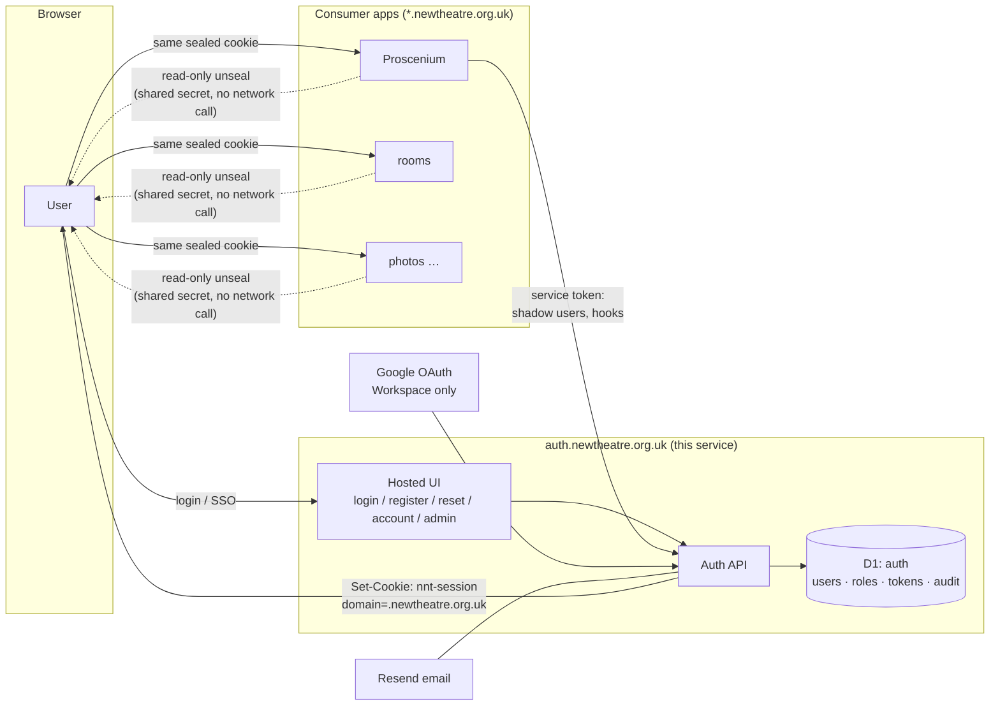

# Architecture

How the NNT auth service works, and why it looks the way it does. Decisions are recorded individually in [decisions/](decisions/); this doc is the assembled picture.

## Context

The estate is a set of small Nuxt 4 apps on Cloudflare Workers, each with its own D1 database: **Proscenium** (public site + box office, serves the apex domain), **rooms** (room booking), **photos** (planned), and eventually a rebuilt ticketing service. Before this service existed, Proscenium and rooms each had hand-rolled email+password auth on `nuxt-auth-utils`, with divergent features and shared bugs (roles frozen into the cookie at login, no revocation; rooms additionally had open registration, no email verification, and no password reset). Full audit: "NNT Auth Service Plan" §3 in the NNT Claude project.

Goals: one account per person estate-wide; Google SSO for Workspace accounts; email+password for everyone else (audience members who only book tickets are the majority user); guest checkout preserved; one place to manage users and roles; bus-factor reduction.

Non-goals (v1): payments, passkeys/MFA, magic links, being a general OIDC provider, central *authorisation* (apps keep their own permission logic).

## The one-diagram version

## Core mechanism: shared sealed-cookie sessions

`nuxt-auth-utils` sessions are stateless cookies sealed (encrypted + authenticated) with `NUXT_SESSION_PASSWORD`. Three configuration choices turn that into estate-wide SSO ([ADR-0003](decisions/0003-shared-sealed-cookie-sessions.md)):

1. **One shared seal secret** across the auth service and every consumer app (worker secret on each).
2. **Cookie scoped to the parent domain**: name `nnt-session`, `domain=.newtheatre.org.uk`, `secure`, `httpOnly`, `sameSite=lax`, `maxAge` 30 days.
3. **Single writer**: only this service calls `setUserSession`/`clearUserSession`. Apps read with `getUserSession()` exactly as they always did — zero added latency, no auth-service call on their request path.

The session payload is a published contract — see [session-contract.md](session-contract.md). The trade-offs (forgeability if any worker leaks the secret; no per-request revocation) and their mitigations (tiny holder set, epoch + staleness refresh, rotation drill) are covered there and in [security.md](security.md).

## Components

**Hosted UI** (`app/pages/`): `/login`, `/register`, `/verify-email`, `/forgot-password`, `/reset-password`, `/account`, `/admin`, plus friendly error pages (e.g. non-Workspace Google account). All accept `?redirect=` validated against the allowlist. Consumer apps link here instead of owning auth pages.

**Auth API** (`server/api/`): JSON endpoints behind the UI, plus machine-only routes — `/api/session/refresh` (re-read user + roles from DB, re-seal cookie), `/api/users/shadow` (service-token; guest checkout), admin user/role management. Full list: [api-reference.md](api-reference.md).

**Google OAuth** (`server/routes/auth/google.get.ts`): `defineOAuthGoogleEventHandler` with `authorizationParams: { hd: 'newtheatre.org.uk' }` as a UX hint and a **server-side check** of `hd` + `email_verified` in the success handler. Links by stable `google_sub`, matching an existing row by lowercased email on first sign-in ([ADR-0005](decisions/0005-workspace-only-google-sso.md)).

**Database** (D1 `auth`, Drizzle): `users`, `user_roles`, `email_verifications`, `password_resets`, `legacy_ids`, `service_tokens`, `audit_log`, rate-limit counters. Reference: [data-model.md](data-model.md).

**Email** (Resend): verification, reset, retention warnings. Same `@react-email/render` rollup stub workaround as Proscenium (Workers quirk).

## Key flows

**Password login** — `/login` → `POST /api/auth/login` → verify scrypt hash → load roles → seal session (`refreshedAt = now`, user's current `epoch`) → redirect to validated target. Rate-limited per IP + per account.

**Google SSO** — `/login` → Google → success handler: assert `hd` + `email_verified`; find by `google_sub`, else match lowercased email and link, else create (`verified: true`, no password) → seal session → redirect. Non-Workspace accounts get an explanation page pointing at email+password registration.

**Reading auth in an app** — `const { user } = await getUserSession(event)`; permission checks stay in the app (Proscenium's ability layer, rooms's `requireAdmin`) but read scoped roles via the shared `hasRole(user, 'app', 'ROLE')` helper ([ADR-0004](decisions/0004-scoped-role-strings.md)).

**Role staleness / revocation** — roles live in the cookie, so changes don't propagate by themselves. Consumer apps' *privileged* middleware checks `refreshedAt`; older than **15 minutes** → bounce through `/api/session/refresh`, which re-reads roles, rejects disabled users and stale `epoch` values (per-user force-logout = bump `users.session_epoch`). Ordinary browsing never refreshes. Estate-wide logout = rotate the seal secret ([operations.md](operations.md)).

**Identity continuity — people who gain (or lose) a Workspace account.** A person is their `users.id`, not their email address. The `email` column is the password-login identifier and contact address; a linked Google identity is a *separate* credential keyed by `google_sub`. So one account can be signed into two ways with two different addresses: email+password with a personal address, **and** Google SSO with a later-acquired `firstname.lastname@newtheatre.org.uk` — same id, same history (training records, bookings, roles all follow, because apps FK the id). Linking paths, in order of preference: **(a) self-service** — logged-in user hits "Connect NNT Google account" on `/account`, completes OAuth (proving control), `google_sub` is stored; **(b) admin-assisted** — an admin sets `pending_google_email` on the account, and the *next* Google sign-in with that address attaches to this account instead of creating a new one (the admin directs the link; the user still proves control by authenticating — an admin can never complete a link alone, by design); **(c) crude fallback** — admin changes the account email to the Workspace address, after which the ordinary first-sign-in email match links it. Google success-handler match precedence: `google_sub` → `pending_google_email` → lowercased email → create new. Losing Workspace (leaver process) just means SSO stops working; the admin unlinks Google and the account continues on email+password. If a duplicate account does get created (person signed in with Google before anyone linked), the recovery is the admin **merge** tool (roadmap — build before the training system ships).

**Guest checkout (shadow accounts)** — Proscenium's booking handler calls `POST /api/users/shadow {email, name}` with its service token; the service matches-or-creates a password-less user and returns the canonical id; Proscenium upserts its local mirror and books as normal. Guests keep booking-ref lookup. A shadow user who later registers, resets a password, or signs in with Google on that email *becomes* a full user with history intact ([ADR-0007](decisions/0007-shadow-accounts-central.md)).

**App-local mirrors** — apps keep thin `users` mirror tables (`id, email, name`) so their FKs stay intact; an `ensureLocalUser(sessionUser)` upsert runs in each app's auth middleware. Migration made local ids equal canonical ids, so this is an idempotent PK upsert.

## Trust boundaries

| Boundary | Mechanism |
|---|---|
| Browser ↔ everything | Sealed cookie; `secure`/`httpOnly`/`lax`; CSRF via same-site + origin check on state-changing routes |
| Consumer app ↔ session | Read-only unseal with shared secret; single-writer rule |
| App server ↔ auth API | Per-app service token (`Bearer`, hashed at rest, constant-time compare) |
| Auth service ↔ app hooks | Auth service calls app `export`/`anonymise` hooks with the same service token |
| Google ↔ auth service | OAuth; server-side `hd` + `email_verified` assertions |
| Admin UI | `auth:ADMIN` role (ITM + continuity holder only) + audit logging |

## What lives where

The auth service owns identity: credentials, Google links, verification/reset tokens, roles, the auth UI, audit of identity actions. Apps own their domains: shows, reservations, bookings, notification preferences, permission *logic*. GDPR machinery spans both via hooks — see [gdpr-retention.md](gdpr-retention.md).
